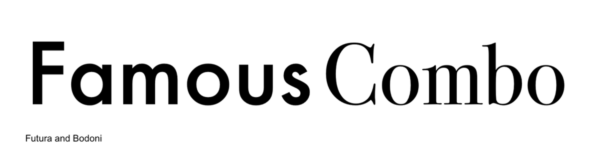
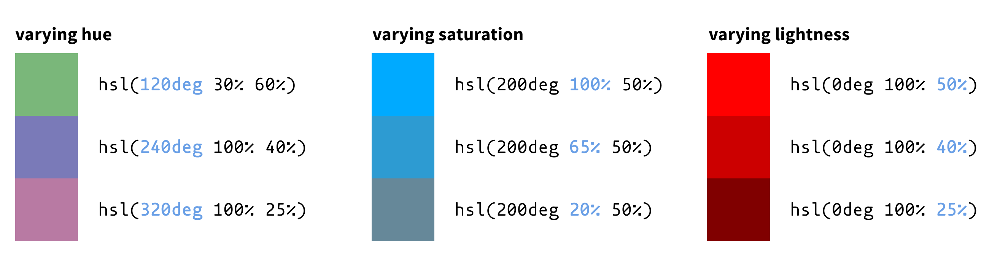

# CSS Continued (Box Model, Sizing, Typography, Color, and Additional Tips)

## Box Model

We already learned the difference between **block** and **inline** elements in week 2. To recap, block elements span the width of their parent container and stack vertically. Inline elements fall "in line" from left to right, then wrap around to a new row once the full parent width is reached. Block elements are like rolling film credits, while inline elements are a typewriter's output.


Every block in CSS consists of four components:


- The **content** box is where your contents, such as text or images, is displayed.
- The **padding** surrounds the content and adds a buffer of white space.
- The **border** wraps around the content and padding.
- The **margin** surrounds all the above, and provides whitespace between the element and any other adjacent elements.

It's easy to get padding and margin confused. Think of padding as "inside" the box—if you apply a background color to an element, it will fill in the padding as well. The margin is "outside" of the box, so any background color applied to the element will not show in the margin.

The content box is sized using the `width` and `height` properties on the element at hand. `padding`, `border`, and `margin` are assigned as properties to the same element.

```
div {
    width: 100px;
    height: 100px;
    padding: 2px;
    border: 5px solid;
    margin: 10px;
}
```

When sizing your elements, be aware that the padding and border sizes are added to the width of an element. So in this case, the complete width of the above element would be:

```
  100px content box
+ 2px left padding
+ 2px right padding
+ 5px left border
+ 5px right border
-------------------
  114px wide
```

When you're trying to make elements fit flush on a webpage, it can be confusing to manually calculate the full computed width of an element by adding the padding and border to the width. To get around this, there is a widely-used **alternative CSS box model** method that starts with the following declaration:

```
html {
    box-sizing: border-box;
}
```

This automatically subtracts the padding and border size from any declared `width` property. That way, when you declare an element's `width: 100px`, you can be sure that the entire thing—border and all—will fit within 100 pixels. Keep in mind, this also means the size of your content box will adjust to accommodate any padding or border.

The alternative box model is usually applied to the top-most element as a universal setting.

### Exercise

To see the box model and alternative box model in action, open `week-4_demo/box-model.html` and try adjusting the properties in `.box` to see how the computed boxes change. Then try un-commenting the `#first` rule and see what happens.

## Sizing

With CSS, you can determine the dimensions of any given element using either 1) fixed values or 2) values that are relative to the size of other things, such as the browser viewport or parent container.

While there are technically many units of measurement for numbers in CSS, we'll be focusing primarily on those that determine spacing and length.[^1]

### Absolute Units

**Absolute units** are those that always render in the browser at the same size. The most common one you'll see by far is `px` or pixels.

Other absolute units include `pt` (points), `pc` (picas), `mm` (millimeters), `cm` (centimeters), and `in` (inches).

### Relative Units

**Relative units** are those that are proportional to the size of something else, like the document root or parent container.

`%` is relative to the size of the element's parent container.

```
parent {
    width: 500px;
}
child {
    width: 50%; /* computes to 250px */
}
```

`em` and `rem` are both determined by an antedecent's `font-size` value, but can be applied to any property that you want to size relative to the text size, like the spacing between columns of text, the padding around a given text element, and so forth.

`em` is relative to the element's parent container's `font-size` value.

```
parent {
    font-size: 14px;
}
child {
    font-size: 1em;   /* 14 * 1 = 14px */
    font-size: 1.2em; /* 14 * 1.2 = 16.8px */
    font-size: 2em;   /* 14 * 2 = 28px */
}
```

`rem` is relative to the `<html>` (or root) element's `font-size` value.

```
html {
    font-size: 16px;
}
child {
    font-size: 1rem; /* 16 * 1 = 16px */
    font-size: 3rem; /* 16 * 3 = 48px */
}
```

Unlike `rem`, which is always based on the root, the computed size of an `em` size can compound, since elements can be nested multiple times.

```
parent {
    font-size: 14px;
}
child {
    font-size: 1em;   /* 14 * 1 = 14px */
    font-size: 1.2em; /* 14 * 1.2 = 16.8px */
    font-size: 2em;   /* 14 * 2 = 28px */
}
grandchild {
    font-size: 1.5em
}
```

For this reason, `rem` is usually preferred over `em`.

`vw` and `vh` stand for **viewport width** and **viewport height**, respectively. The **viewport** is the entire viewable area of a browser window, at any given time or on any given device, which can vary quite a bit. Luckily, the viewport size is tracked by the browser in real-time, allowing us to base the size of our webpage's contents on a percentage of the current viewport dimensions. `1vw` equals 1% of the viewport width, and `1vh` equals 1% of the viewport height, so an element with `width: 50vw` will always take up exactly half the browser window's width, regardless of screen size or if the user resizes their browser.

```
/* say the viewport width = 1920px,
and the viewport height = 1080px */

element {
    width: 1vw;  /* 1920 * 0.01 = 19.2px */
    height: 1vh; /* 1080 * 0.01 = 10.8px */
}
```

`%`, `em`, `rem`, `vw`, and `vh` are the main relative units that you'll work with. Relative sizing is an especially important feature of CSS that allows a web page's contents to be displayed proportionally across various screen sizes and devices—or what is called **responsiveness**. We'll learn about this more next week. For now, just know that relative units are used more widely than absolute units because of their adaptability.

Here's a good reference to know when to use the different CSS units:


Note that you don't always need to define an element's dimension explicitly. Block-level elements like `<div>`, `<p>`, and `<h1>` automatically take up the full width of their parent container and expand vertically to fit their content. Elements with content (i.e. text, images, or nested elements) will be sized based on that content. However, empty elements or elements without content (like an empty `<div>`) will collapse to zero height, making them invisible unless you set the dimensions yourself.

### Exercise

To practice using sizes, try the following in `week-4_demo/sizing.html`:

1. Using pixel units, resize the example image to fit within your browser window. _Tip: To keep the original image asset ratio, set either the width or the height using pixels, and then set the other to "auto"._
2. Using percent units, make all the text fit within half the window.
3. Using pixel units, assign a font size to the `#container` div. Then use rem units to assign font sizes to `h1`, `h2`, `h3`, and `p`.
4. Use rem units to adjust the padding on each `p`.

## Typography

Typography is one of many levers that web designers can use to distinguish their site. Its function is more than just aesthetic; juxtaposed text styles establish visual hierarchy within a given site's contents. Particular font choices also impart character and symbolic meaning to a website, allowing it to borrow the connotations of a given "genre" of visual language.

### Type Vocabulary


#### Letter parts

- **Baseline**: the invisible line letters sit on
- **X-height**: the height of lowercase letters (excluding ascenders and descenders—so the height of the "x" letter)
- **Cap height**: the height of capital letters
- **Ascender**: the part of a letter that extends above the x-height (like in 'h', 'b', 'd')
- **Descender**: the part that extends below the baseline (like in 'g', 'p', 'y')

#### Spacing

- **Kerning** AKA **letter spacing**: the space between letters
- **Leading**: the space between lines of text

#### Typeface Classifications

The most common categories of typefaces are **serifs**, **sans-serifs**, **monospace**, and **display** AKA **decorative**.

Serifs and sans-serifs are differentiated by the way strokes within the letters finish. Serif fonts have a little "foot" or taper at the end of their strokes, while sans-serif fonts end uniformly. Many serif fonts originated from the pre-digital era, when letters were standardized for printing presses, which is why they have a "classic" look. Sans-serif fonts convey a more modern look in comparison.


Monospace fonts have consistent spacing between each character. They are also known as typewriter fonts because they originated from typewriters and were designed to fit neatly into columns. Today, their uniform nature makes them fit for purposes like coding, data, and ASCII art.

Display or decorative fonts are an umbrella category for any fonts that are used in larger displays, such as for logos and headings. Because they can be quite ornate, they're not recommended for use in small, long stretches of text, such as within the body of your website.

#### CSS Properties

Here are the main properties you'll use to style text in CSS:

```
p {
  font-family: 'Georgia', serif; /* typeface */
  font-size: 16px;               /* text size */
  font-weight: 400;              /* text thickness */
  font-style: italic;            /* normal, italic, or oblique */
  line-height: 1.5;              /* space between lines of text */
  letter-spacing: 0.5px;         /* space between letters */
  text-transform: uppercase;     /* uppercase, lowercase, capitalize */
  text-decoration: underline;    /* underline, line-through, none */
}
```

### Font Combinations


Different types of typefaces can be paired to create visual interest and meaningful contrast. When it comes to pairing fonts, the first tip is to make sure your fonts are reasonably differentiated. If they're too similar, it can create an unsettling effect.

Next, try to limit the number of different typefaces on your webpage to just two. Three is permissable, but pushing it. Rather than using entirely different typefaces to create contrast, vary the font weight, size, and letter spacing to create different effects.

Generally, it's good to pair fonts that have similar x-heights, since it helps them flow together visually.



Combining fonts from within the same font family is also technically font pairing, since variation can be significant.


### Creating Hierarchy with Type


Hierarchy is established primarily through a combination of size, weight, spacing, and color.

Size is the most intuitive way to indicate importance across various header levels, paragraphs, captions, and so forth. Generally, the most important information (`<h1>`) should be the largest, and size decreases as importance decreases.

Due to nuances in optical perception and digital rendering, font sizes do not always scale down in even increments. Designers will use standardized scales that determine the best size ratios between different text elements. [Typescale.com](https://typescale.com/) is a web tool that allows you to preview a font across these various scales.


Aside from this, there is no one way to create hierarchy within text. Again, it's better to use variations within the same typeface than switching between too many fonts. How you apply those variations are largely up to you, just make sure each level is sufficiently differentiated.

### Finding Fonts

[Google Fonts](https://fonts.google.com/) has the most extensive library of free and open-source fonts that are optimized for the web.

[Adobe Fonts](https://fonts.adobe.com/fonts) also has an extensive selection, but you need a Creative Cloud subscription to access them.

[Font Squirrel](https://www.fontsquirrel.com/) is also pretty reliable. All their fonts are marked for commercial use.

[DaFont](https://www.dafont.com/) has a more eclectic collection but has been around for a while.

[Velvetyne](https://www.velvetyne.fr/) and [Uncut](https://uncut.wtf/) have some rarer gems.

Note that not all fonts are free to use, especially for commercial projects, so be sure to check the license before using a font.

- **Open Font License (OFL)**: Free to use, modify, and distribute (common on Google Fonts)
- **Personal Use Only**: Free for personal projects, requires purchase for commercial work
- **Commercial License**: Must be purchased; terms vary by foundry
- **Web Font License**: Specific permission to use fonts on websites (sometimes separate from desktop licenses)

### Using Fonts

#### Web Safe Fonts

In the early days of the web, designers were limited to **web safe fonts**, which were a small set of typefaces pre-installed on most operating systems. If you specified a font the user didn't have, the browser would substitute it with a default, often breaking your design.

Common [web safe fonts](https://www.w3schools.com/csSref/css_fonts_fallbacks.php) are:

- Serif: Georgia, Times New Roman, Garamond
- Sans-serif: Arial, Helvetica, Verdana, Tahoma
- Monospace: Courier New, Courier

While web safe fonts are reliable and load instantly, their selection is limited. Nowadays, web designers use **custom web fonts** that require a separate font file, and instead use web safe fonts as **fallback fonts**, or fonts that the browser defaults to in case the custom font file doesn't work.

#### Font File Formats

**WOFF (Web Open Font Format)** and **WOFF2**

- Optimized for web use
- Compressed for faster loading
- Supported by all modern browsers
- Use when available

**TTF (TrueType Font)** and **OTF (OpenType Font)**

- Older formats with larger file sizes than WOFF
- These are sufficient but they're technically optimized for print
- Good fallback option for older browsers

#### Loading Fonts in CSS

Try loading custom fonts into `/week-4_demo/font.html` via Google Fonts...

1. Go to [Google Fonts](https://fonts.google.com/).
2. Click into any font you want.
3. Click "Get font" button and then "get embed code".
4. Copy the `<link>` tags and paste them into the `<head>` of your HTML.
5. To apply the font to an element, use the `font-family` property and write the font name within single or double quotation marks.
6. After your desired font, add a websafe / fallback font that falls within the same category as your desired font. Note that websafe fonts do not need to be within quotes.

```
body {
    font-family: 'Open Sans', Arial, sans-serif;
}
```

... or via a local file...

1. Download your font files from a source like Font Squirrel.
2. Place the fonts into new subfolder within your project directory (you can call it `assets` or `fonts`).
3. Use the `@font-face` rule in CSS to set up your font's name, source file path and type, weight, and style.
4. Apply the font to an element using the name you gave it.

```
@font-face {
    font-family: 'Aleo';
    src: url('/fonts/aleo.woff2) format('woff2'),
         url('/fonts/aleo.woff) format('woff'),
         url('/fonts/aleo.ttf) format('truetype');
    font-weight: 400;
    font-style: normal;
}

body {
    font-family: 'Aleo', Georgia, serif;
}
```

If you want to include different weights or styles of the same typeface, you need to declare them in their own separate `@font-face` rules. The only values that should differ are the file paths and weight and/or style.

As you can see, you can also name a generic font family as a fallback font. If your custom font fails to load, the browser will keep trying the next listed font until it hits the first one available. The full list of generic font families is `serif`, `sans-serif`, `monospace`, `cursive`, and `fantasy`.

## Combining Size and Typography

Per accessibility standards, 16px is considered the minimum font size for regular body text. To make it easier on yourself, you can set this once as your "global" text size in the root element and then use `1rem` every time you want something to be `16px`. That way, you can later adjust the base font size of your document, and all the text will be updated proportionally.

```
html {
    font-size: 16px;
}
h1 {
    font-size: 3rem;
}
body {
    font-size: 1rem;
}
```

Line height or leading does not necessarily need a unit. Any value assigned to the `line-height` property represents a ratio.

```
p {
    font-size: 16px;
    line-height: 1.7;  /* 16 * 1.7 = 27.2px between baselines */
}
```

The default line height is roughly `1.2`, depending on the element's `font-family`. Accessibility guidelines suggest using a minimum `1.5` line height for smaller body text. Headers can afford to have tighter line spacing.

## Color

In CSS, there are myriad ways to declare color values. Below are the most commonly used. As you read along, use the color picker tool in `week-4_demo/color-values.html` to see the values in action.

### CSS color names: `red`, `green`, `blue`

- Intuitive names for 140 predesignated colors
- These include the usual `Red`, `Brown`, `Black`, but also many refined colors like `MediumAquaMarine` and `PapayaWhip`
- You can find the full list on [W3Schools](https://www.w3schools.com/cssref/css_colors.php)

### RGB values `rgb(255, 255, 255)`

- RGB = red, green, blue
- Each value controls the intensity of the respective color
- The values range from 0 to 255, with 0 meaning no intensity and 255 meaning full intensity

#### RGBA values `rgba(0, 0, 255, 0.5)`

- Same as RGB, but with an added value for alpha, or opacity / transparency
- Represented as a number between 0.0 and 1.0, with 1.0 being full opacity
- The example value above is blue at half transparency

### Hexadecimal values (6 digits) `#0000FF`

- Arguably the most common way to define colors, due to its conciseness
- A complete hex code consists of a hash followed by six digits ranging from 0-9 and the letters A-F, where A = 10 and each letter counts up until F = 15
- Think of it as three pairs of values: `#RRGGBB`
  - `RR` = the intensity of red
  - `GG` = the intensity of green
  - `BB` = the intensity of blue
- A value of `00` would be invisible and `FF` would be full intensity

#### Hexadecimal values (8 digits) `#0000FF80`

- Similar to RGBA, hex codes with 8 digit placements include the alpha value, with 00 being fully transparent and FF being fully opaque
- `rgba()` is more widely used to determine colors with less-than-full opacity, since it's more intuitive

### HSL values `hsl(240, 100%, 50%)`

- HSL = hue, saturation, lightness
- Hue is a degree on a [color wheel](https://www.pngkey.com/png/detail/226-2265055_hsl-color-wheel-color-wheel-hue-saturation-value.png) from 0 to 360, with 0 being red, 120 being green, and 240 being blue
- Saturation is a value from 0% to 100%, with 100% being the most "intense"
- Lightness is a value from 0% to 100%, with 100% being the lightest version of that color
- HSL values can be useful when you're creating a color palette and want different shades of the same color, or different colors at the same saturation and lightness:



#### HSLA values

- HSL values with alpha added as a number between 0.00 and 1.00, with 1.00 being full opacity

<br/>

All of the color values covered above are just different ways of representing the same point in the color spectrum. They are easily translated from one into another. One way to select and translate colors from within the VS Code editor is by using the **Color Highlight extension**. Not only does it paint any color values stated in your document in the given color, making them easier to preview, but it also enables a quick color picker module you can use to select colors from a visual spectrum, switch between value types, and select colors from elsewhere using a dropper.

Finally, you might be wondering where you'll be using color values. Here are some CSS properties that accept color values alone...

- `color` (text color)
- `background` or `background-color`[^2]
- `border-color`, `border-bottom-color`, `border-top-color`, `border-left-color`, or `border-right-color`
- `text-decoration color`

... or in conjunction with other values, like size, style, x- and y-offset, and blur radius:

- `border`
- `box-shadow`
- `text-decoration`
- `text-shadow`

### Exercise

Try assigning colors to the above properties for the elements in the `week-4_demo/color-properties.html` file.

### Color Combinations

When choosing what colors to use on your website, or for any visual design, I would suggest starting with a neutral or muted color as your base color. This color should take up the majority of visual real estate on your website. Then pick 1-2 secondary colors that stand out a bit more and use these to differentiate sections and headers. Finally, pick 1-2 accent colors that have high saturation and/or brightness. Use these sparingly and only when you need the reader's attention, like on a call-to-action button.

That said, you rarely have to come up with a color combination from scratch. There are hundreds of tools online that designers use to choose color palettes. Use these to your advantage. I like using [coolors.co](https://coolors.co/) to generate semi-randomized palettes quickly.

Just as with HTML, there is a way to use colors semantically. For example, red usually connotes an error or alert, while green connotes a successful outcome. Follow the existing associations people have with colors (look up "color theory" if you want to know more). Of course, this won't apply to all cases, like if you're making a website for the retailer Target or a Lunar New Year party. There are not many hard and fast rules with color choices, but understand that certain colors give readers an expectation of what a given element should do or mean.

Finally, make sure there's [enough contrast](https://webaim.org/resources/contrastchecker/) between the text color and the background color. Keep in mind the acceptable contrast ratios vary for body text, large text, and text that appears on user interface components (like buttons and forms).

If you want to know more about best practices for color usage in web design, [this design.dev guide](https://design.dev/guides/color-theory/) is one of the better ones I've seen, though ironically it seems to not pass the contrast check.

## Variables

Now that we know how to customize size, color, and fonts within CSS, we can set off declaring the styles of every element that appears on our website! Using classes and wide-net selectors can help us style more elements in fewer lines, but what happens when you decide to change a color halfway through? Or you find out that a font isn't licensed for your purposes?

Rather than `CMD`/`CTRL` + `F`-ing through your entire document to replace the values, it's easier to use **variables** AKA **custom properties**. Variables allow you to define a value by a custom name and use that name as a proxy for the actual value throughout your document.

Variable names must start with two dashes `--` and are case-sensitive. You can reference the variable by using the `var()` function.

```
:root {
    --color-accent: #3569da;
}
button {
    background-color: var(--color-accent);
}
```

**Note:** `:root` is another way of selecting `<html>`.

Usually variables are defined in the root element so they can be "globally" available (available throughout your entire document). You can also declare variables within a more local scope, say within a `<div>`:

```
div {
    --spacing: 8px;
    padding: var(--spacing);
}
```

You can also create variables for fonts...

```
:root {
  --font-heading: 'Playfair Display', Georgia, serif;
  --font-body: 'Open Sans', 'Segoe UI', Arial, sans-serif;
}
body {
  font-family: var(--font-body);
}
h1, h2 {
    font-family: var(--font-heading);
}
```

... and sizes.

```
:root {
    --container-sm: 640px;
    --container-md: 768px;
    --container-lg: 1024px;
    --container-xl: 1280px;
}

.card {
    width: var(--container-md);
}
```

Just as with `font-family`, you can provide a fallback value as a second argument to `var()`, in case a variable isn't defined.

```
p {
  color: var(--text-color, #333333);
}
```

Variables are commonly used to differentiate "dark mode" vs. "light mode" styles on a webpage.

## More Tips!

### Nested Declarations

Last week we learned how to apply the same styles to nested elements using combinators like `>`, `+`, `~`.

Another way to style nested elements is by nesting the entire declarations themselves within a parent element's declaration.

```
.form {
    color: black;

    .form__button {
        background-color: gray;
    }
}
```

This technique is called **CSS nesting**, and it can make your stylesheets easier to read and reduce your file size by eliminating repeat selectors.

You can also add combinators into nested declarations as such:

```
.form {
    color: black;

    > .form__heading {
        background-color: skyblue;
    }
}
```

### Advanced CSS Hierarchy

Last week we learned how CSS styles are applied hierarchically within a document and across various sources. Generally, styles are prioritized within a document by:

1. Where they are in the document
   - Declarations closer to the bottom override overlapping declarations above
2. How specific the selectors are
   - More specific selectors (i.e. `#main-paragraph`) will be prioritized over more general ones (i.e. `p`)

_**Quick Review:**_ What is the priority order of styles written across various sources (e.g. inline, internal, external, browser)?

Another way to control priority order within the cascade is by adding the `!important` flag at the end of a property-value pair. This flag forces a given style to override any other declarations that apply to a selection. Here's a demo from MDN Web Docs:

```
selector {
  property: value;            /* normal declaration */
  property: value !important; /* important declaration (preferred) */
}
```

The `!important` flag is good for troubleshooting when you're not sure why a style is being applied. For example, if a style doesn't compute on screen until you apply the `!important` flag, it tells you that the normal declaration of the style may not be applied because of a conflicting style applied with more specificity / further down in the document.

Another use case is when you're customizing the styling within a website template with preexisting CSS rules. Templates often come with their own stylesheets that use high-specificity selectors, making it difficult to override their defaults with your own styles. Using `!important` lets you force your customizations to take precedence without having to match or exceed the template's selector specificity.


`!important` helps when you're in a pinch, but should be used sparingly because it can make stylesheet management confusing. Try to follow the default rules of the cascade to ensure that your CSS markup remains predictable and maintainable. When styles rely heavily on `!important` flags, it becomes harder to debug issues and make future changes, since you'll need to remember which rules are forced and why.

---

[^1]: If you're curious, the other units of measurement would include those relating to angles, time, resolution, and frequency. These will come up as we progress through CSS basics.

[^2]: Shorthand properties like `background` set multiple related properties at once, such as color, size, image, and repeat method. Some other shorthand properties are `border`, `margin`, `inset`, and `flex`—we'll see these in action as we go.
